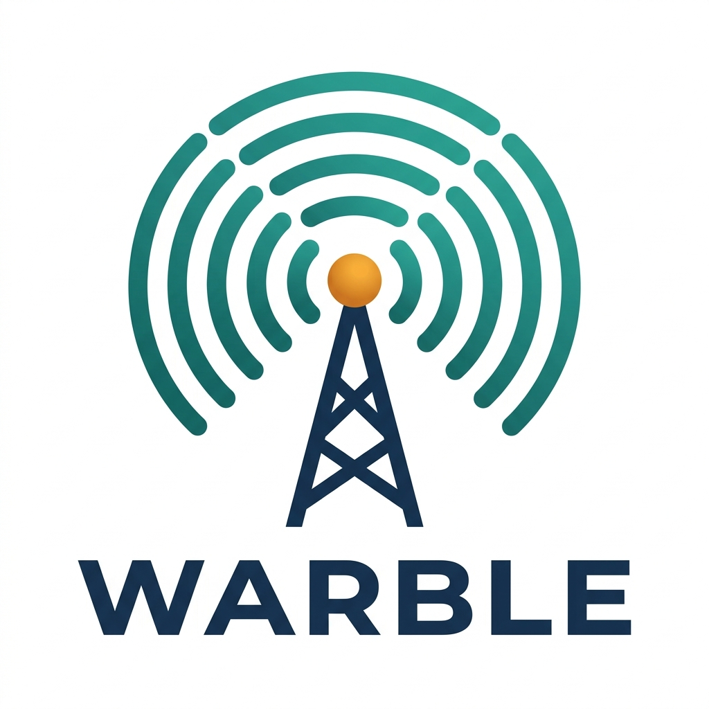

<p align="center">
  
</p>

#  Warble

> **Warble: radio programming for the web**

Warble is a modern, open-source web application for programming amateur (ham) radio transceivers directly from your browser — no software installation required. Built from scratch using web technologies, it runs natively in Chrome or Edge via the **Web Serial API**.


---

## ✨ Features

### 🔌 Direct USB Radio Programming
- Connect your radio via a standard USB programming cable (FTDI, CP2102 or CH340 chip)
- Read and write channel memory directly to the radio using the **Web Serial API**
- No drivers, no Java, no desktop app needed — just Chrome or Edge

### 📻 Supported Radios
| Model | Channels | Mode | Protocol |
|---|---|---|---|
| **Baofeng UV-5R** (and variants) | 128 | FM analog | Standard UV-5R |
| **Baofeng UV-5R MINI** | 999 | FM analog | UV17Pro (encrypted) |
| **Radtel RT-4D** | 3072 | FM + **DMR** | Proprietary (reverse-engineered) |

> The UV-5R MINI driver implements a **reverse-engineered protocol** from the UV17Pro family, including a custom handshake and XOR encryption (`CO 7` mask).
> The RT-4D driver was reverse-engineered from USB serial captures (SPM), supporting both read and write of the proprietary `.ddmr` flash dump format (1 MB, 115200 baud). **Verified on real hardware.**

### 📊 Spreadsheet-style Channel Editor
- AG Grid-powered table interface with a familiar spreadsheet view
- Edit channel name, frequency, duplex, offset, CTCSS/DCS tones, mode, power, and skip flag
- Real-time **frequency validation** with colour-coded error highlighting (red = out of range for your radio)
- Inline cell editing with instant feedback

### 🗂️ Virtual Zones
Organise your channels into virtual zones (groups of 32 channels) for easier navigation of large channel lists:
- Switch between zones without affecting the underlying channel data
- Ideal for separating repeaters by region, activity type (PMR, VHF, UHF), etc.
- Transparent to the radio: zones are a UI-only concept in Warble

### 📡 RepeaterBook Integration
- Search and import amateur repeaters from **[RepeaterBook](https://repeaterbook.com/)** directly into your channel list
- Filter by country, region/state, and frequency band (VHF / UHF / ALL)
- **Smart hardware filter:** only repeaters compatible with your selected radio model are imported
- Optional proximity sort: enter your GPS coordinates to sort repeaters by distance

### 🚨 PMR446 Quick-add
- One-click insertion of all 16 standard **PMR446** channels (446.00625–446.19375 MHz)
- Automatically placed after your existing channels

### 💾 Import / Export
- **Import** `.img` (radio binary image) and `.csv` files
- **Export** to `.csv` and save `.img` binary images
- Drag-and-drop file support

### 🌍 Multilingual UI
- Interface available in **Catalan (CA)**, **Spanish (ES)**, and **English (EN)**
- Language auto-detected from your browser settings

### 🗄️ Codeplug Repository *(Phases 1–4 live)*
- Community repository for sharing, browsing and downloading radio codeplugs
- Upload `.img`, `.csv` or `.ddmr` files with title, description, brand, model, country and region
- **Auto-detection** of radio model from `.img` metadata footer (UV-5R, UV-5R MINI) and from `.ddmr` magic bytes (RT-4D)
- Browse and filter by brand, model, country — sort by newest, most downloaded, or best rated
- **In-browser channel preview** — inspect channels without downloading, powered by Warble's own drivers (including DMR columns: Timeslot, TalkGroup)
- **Load to editor** — load a community codeplug directly into the channel editor
- **Star ratings (1–5)** with average score displayed on each card
- **Threaded comments** — two-level reply threads per codeplug
- **Report system** — flag inappropriate codefiles or comments for moderation
- Download counter tracked via Supabase RPC
- Paginated results (20 per page)
- Requires a free user account to upload, download, rate, and comment

### 🔐 User Accounts
- Registration and login via **Supabase Auth** (email + password)
- Optional ham radio callsign stored in user profile
- Persistent sessions across browser reloads

### 🎛️ Global Radio Settings
- View and edit global radio parameters (VOX, squelch, backlight, etc.) via a dedicated settings panel
- Settings schema is driver-specific: each radio model defines its own editable fields

---

---

## 🖥️ Requirements

| Requirement | Details |
|---|---|
| Browser | **Google Chrome** or **Microsoft Edge** (v89+) |
| Operating System | Windows, macOS, or Linux |
| Hardware | USB programming cable for your radio (FTDI or CP2102 chip recommended) |
| Internet | Required only for RepeaterBook import |

> ⚠️ **Firefox and Safari are not supported**, as they do not implement the Web Serial API. This is a browser limitation, not a Warble limitation.

---

## 🚀 Getting Started (Local Development)

### Prerequisites

- [Node.js](https://nodejs.org/) v18 or higher
- npm (included with Node.js)
- Git

### Installation

```bash
# 1. Clone the repository
git clone https://github.com/cdelcollado/Warble.git
cd Warble

# 2. Install dependencies
npm install

# 3. Start the development server
npm run dev
```

Then open your browser at **http://localhost:5173**

### Building for Production

```bash
npm run build
```

The compiled output will be in the `dist/` folder, ready to be served by any static web server.

### Preview Production Build Locally

```bash
npm run preview
```

---

## 📖 How to Use

### 1. Selecting Your Radio
Use the **radio model selector** at the top of the interface to choose your device (e.g., *Baofeng UV-5R MINI*). This determines:
- The number of available channels (128 for UV-5R, 999 for MINI)
- The valid frequency ranges used for validation
- The binary protocol used for reading/writing

### 2. Reading Your Radio
1. Connect your radio via USB cable and turn it on
2. Click the **USB Connection** tab (or the radio icon)
3. Click **"Read from Radio"** — your browser will ask you to select the serial port
4. Wait for the progress bar to complete; channels will appear in the grid

### 3. Editing Channels
- Click any cell to edit it inline
- Invalid frequencies are highlighted in **red**
- Use the toolbar buttons to: add a channel, add PMR446, import from RepeaterBook, export CSV, or clear selected rows

### 4. Writing to Your Radio
1. Make sure all cells are valid (no red highlights)
2. Click **"Write to Radio"** — the app will encode and send all channels to the radio
3. ⚠️ **Important:** Do not disconnect the cable during a write operation

### 5. Importing from RepeaterBook
1. Click the **RepeaterBook** button (satellite icon) in the toolbar
2. Select your country and region
3. Optionally filter by band (VHF/UHF) or enter your coordinates for proximity sorting
4. Click **Import** — only repeaters compatible with your radio will be added

---

## ⚠️ Important Notes

### Web Serial API
The Web Serial API requires the page to be served over **HTTPS** (or `localhost`). If you deploy Warble to a public server, make sure to use TLS.

### RepeaterBook Proxy
RepeaterBook's API requires a specific `User-Agent` header to authorise requests. In development (`npm run dev`), Vite's built-in proxy handles this automatically. For production deployments, you will need a small server-side proxy (e.g., a Vercel Serverless Function) to forward requests with the correct header.

### Radio Safety
Always back up your radio configuration before writing new data:
1. Read from radio → Save as `.img` (click "Save Image")
2. Make your changes
3. Write to radio

---

## 🛠️ Project Architecture

This section describes the full technical architecture of Warble: the technology stack, the module structure, how data flows through the application, and the key design decisions behind each layer.

---

### Technology Stack

| Layer | Technology | Version | Role |
|-------|-----------|---------|------|
| **Language** | TypeScript | ~5.9 | Strict typing throughout the entire codebase |
| **UI Framework** | React | ^19.2 | Component-based declarative UI |
| **Build Tool** | Vite | ^5.4 | Dev server (HMR), ESM-native production bundler |
| **Styling** | Tailwind CSS | ^3.4 | Utility-first CSS, dark mode via `class` strategy |
| **Grid** | AG Grid Community | ^35.1 | High-performance spreadsheet-style channel editor |
| **Icons** | Lucide React | ^0.575 | SVG icon library, tree-shakeable |
| **Toasts** | react-hot-toast | ^2.6 | Non-blocking in-app notifications |
| **Class merging** | clsx + tailwind-merge | ^2.1 / ^3.5 | Conditional Tailwind class composition |
| **i18n** | i18next + react-i18next | ^25.8 / ^16.5 | Runtime translations CA / ES / EN |
| **Language detect** | i18next-browser-languagedetector | ^8.2 | Auto-detects locale from browser |
| **Backend** | Supabase | ^2.101 | PostgreSQL + Auth + Storage + RLS + RPCs |
| **Serial API** | Web Serial API (W3C) | — | Native browser API for USB serial communication |
| **Testing** | Vitest + Happy DOM | ^4.1 / ^20.8 | Unit tests with DOM simulation |
| **Testing utilities** | @testing-library/react | ^16.3 | Component testing helpers |
| **Linting** | ESLint 9 + typescript-eslint | ^9.39 / ^8.48 | Static analysis, React Hooks rules |
| **CI/CD** | GitHub Actions | — | Lint + TypeScript check + build + tests on every push |

> The application is a **100% client-side SPA** (Single Page Application). There is no custom backend server. All persistent data (user accounts, uploaded codefiles, ratings, comments) is handled by the hosted Supabase project. Radio programming runs entirely in the browser via the Web Serial API.

---

### Source Tree

```
src/
├── App.tsx                     # Root component — routing, file open/save, driver switching
├── auth/
│   ├── AuthModal.tsx           # Login / register modal
│   └── useAuth.ts              # Hook: session management, signIn, signUp, signOut
├── components/
│   ├── MemoryGrid.tsx          # AG Grid channel editor with inline editing & validation
│   ├── GlobalSettings.tsx      # Driver-specific global settings panel (schema-driven)
│   ├── RadioProgrammer.tsx     # USB read/write UI with progress bar
│   └── Sidebar.tsx             # Left navigation: tabs, file actions, driver selector
├── hooks/
│   ├── useToast.ts             # Wrapper around react-hot-toast
│   └── useFrequencyValidation.ts # Frequency validation against driver limits
├── lib/
│   ├── drivers/
│   │   ├── index.ts            # SUPPORTED_RADIOS registry + getDriverClass() factory
│   │   ├── uv5r.ts             # Baofeng UV-5R driver (FM analog, standard protocol)
│   │   ├── uv5rmini.ts         # Baofeng UV-5R MINI driver (UV17Pro, XOR-encrypted)
│   │   └── rt4d.ts             # Radtel RT-4D driver (DMR + FM, proprietary .ddmr format)
│   ├── binary.ts               # Low-level binary utilities (BCD, uint, buffer helpers)
│   ├── imgDetection.ts         # Auto-detect radio model from .img footer / .ddmr magic
│   ├── pmr.ts                  # PMR446 channel table (16 channels, 446 MHz)
│   ├── repeaterbook.ts         # RepeaterBook API integration (search + import)
│   ├── security.ts             # File validation, XSS sanitization, CSV injection prevention
│   ├── serial.ts               # Web Serial API wrapper (connect, read, write, buffers)
│   ├── supabase.ts             # Supabase client, TypeScript types, RADIO_BRANDS catalogue
│   └── types.ts                # Core TypeScript interfaces: MemoryChannel, IRadioDriver, etc.
├── locales/
│   ├── ca.json                 # Catalan translations
│   ├── es.json                 # Spanish translations
│   └── en.json                 # English translations
├── repository/
│   ├── RepositoryPage.tsx      # Browse page: search, filters, pagination
│   ├── CodefileCard.tsx        # Card: metadata, star display, preview & download buttons
│   ├── CodefileDetailModal.tsx # Community modal: star ratings, threaded comments, reports
│   ├── PreviewModal.tsx        # In-browser channel preview (read-only AG Grid)
│   ├── UploadModal.tsx         # Upload form with cascading brand→model selects
│   └── useRepository.ts        # All Supabase interactions for the repository feature
└── __tests__/
    ├── binary.test.ts          # Unit tests for binary utilities
    ├── security.test.ts        # Unit tests for security functions
    └── setup.ts                # Vitest + Happy DOM setup
```

---

### Driver Architecture

Every supported radio is implemented as a class that satisfies the `IRadioDriver` interface defined in `src/lib/types.ts`. This contract fully isolates radio-specific logic from the rest of the application.

```typescript
export interface IRadioDriver {
  readonly name: string;        // Human-readable display name
  connect(): Promise<void>;
  disconnect(): Promise<void>;
  readFromRadio(onProgress?: (pct: number) => void): Promise<Uint8Array>;
  writeToRadio(data: Uint8Array, onProgress?: (pct: number) => void): Promise<void>;
  decodeChannels(data: Uint8Array): MemoryChannel[];
  encodeChannels(channels: MemoryChannel[], baseBuffer: Uint8Array): Uint8Array;
  getFrequencyLimits(): { min: number; max: number }[];
  getGlobalSettingsSchema(): SettingDef[];
  decodeGlobalSettings(data: Uint8Array): GlobalSettings;
  encodeGlobalSettings(settings: GlobalSettings, baseBuffer: Uint8Array): Uint8Array;
}
```

The registry in `src/lib/drivers/index.ts` exports:
- **`SUPPORTED_RADIOS`** — array of `{ id, name, channelCount }` metadata, used to populate the UI selector and to decide whether to show the zones panel (`channelCount > 32`)
- **`getDriverClass(id)`** — factory function that returns the driver class for a given ID

Each driver handles its own:
- **Serial protocol** (handshake sequences, block structure, baud rate, checksums)
- **Binary encoding/decoding** (memory layout, field offsets, data types)
- **Settings schema** (which global parameters are editable and how they map to buffer offsets)
- **Frequency limits** (used by the grid for real-time validation)

#### Current drivers

| Driver file | Radio | Protocol | Format | Notes |
|-------------|-------|----------|--------|-------|
| `uv5r.ts` | Baofeng UV-5R | Standard UV-5R (9600 baud) | `.img` (6152 B) | Reference implementation |
| `uv5rmini.ts` | Baofeng UV-5R MINI | UV17Pro (XOR `CO 7` mask) | `.img` (33344 B) | Reverse-engineered from `baofeng_uv17Pro.py` |
| `rt4d.ts` | Radtel RT-4D | Proprietary block protocol (115200 baud, CH340) | `.ddmr` (1 MB) | Fully reverse-engineered from SPM USB captures; verified on real hardware |

---

### Data Flow

#### Opening a file from disk

```
User selects file
  → App.tsx: handleFileUpload()
      .ddmr  → decodeRT4D()          → setChannels() + handleDriverChange('rt4d')
      .img   → detectRadioFromImg()  → [driver mismatch dialog?]
                                      → processImgFile() → driver.decodeChannels()
                                                         → driver.decodeGlobalSettings()
      .csv   → CSV text parser       → setChannels()
```

#### Reading from radio (USB)

```
User clicks "Read from Radio"
  → RadioProgrammer.tsx
      → driver.connect()          (Web Serial API: port.open at baud rate)
      → driver.readFromRadio()    (handshake + block reads + checksum verify)
      → setChannels(decoded)
      → setRawBuffer(raw Uint8Array)
      → setGlobalSettings(decoded settings)
```

#### Writing to radio (USB)

```
User clicks "Write to Radio"
  → RadioProgrammer.tsx
      → driver.encodeGlobalSettings(settings, rawBuffer)
      → driver.encodeChannels(channels, buffer)
      → driver.writeToRadio(finalBuffer)   (handshake + block writes + ACK wait)
```

#### Saving to file

```
User clicks "Save Image (.img / .ddmr)"
  → App.tsx: handleSaveImg()
      → driver.encodeGlobalSettings(settings, rawBuffer)
      → driver.encodeChannels(channels, buffer)
      → Blob → URL.createObjectURL → <a download> click
```

---

### Backend: Supabase

Warble uses **Supabase** as a fully managed BaaS (Backend as a Service). No custom server-side code is required.

#### PostgreSQL tables

| Table | Purpose |
|-------|---------|
| `profiles` | User profiles: callsign, country. FK → `auth.users` |
| `codefiles` | Uploaded codeplugs: metadata, brand, model, format, storage path, download count, avg rating |
| `ratings` | Star ratings (1–5) per user per codefile. Unique constraint `(codefile_id, user_id)` |
| `comments` | Threaded comments: top-level and replies (`parent_id` self-FK). Soft-deletable |
| `reports` | Content reports (codefiles or comments) for moderation |

#### Row-Level Security (RLS)

All tables have RLS enabled. Key policies:
- `codefiles`: anyone can read; only authenticated users can insert; only the author can delete
- `ratings`: authenticated users can upsert/delete their own rating; all can read
- `comments`: authenticated users can insert; authors can delete their own; all can read
- `reports`: authenticated users can insert; read restricted to admins

#### Storage

A single bucket `codefiles` stores the raw codeplug files. Access is controlled by Supabase Storage policies (upload requires auth; download requires auth; files are referenced by signed URL).

#### Server-side functions (RPC)

- **`increment_downloads(codefile_id)`** — atomic increment of `downloads` counter, callable by authenticated users
- **`avg_rating` trigger** — PostgreSQL trigger on `ratings` that keeps `codefiles.avg_rating` and `codefiles.rating_count` denormalized and always up to date

#### Client

The Supabase JavaScript client (`@supabase/supabase-js`) is initialised once in `src/lib/supabase.ts` with the project URL and public anon key from environment variables. Auth state is managed globally via `useAuth.ts`.

---

### Internationalisation (i18n)

Translations live in `src/locales/{ca,es,en}.json` and are loaded at runtime by **i18next**. The `i18next-browser-languagedetector` plugin reads the browser's `navigator.language` to set the initial locale automatically; the user can override it from the sidebar.

All user-visible strings — including error messages, toast notifications, column headers, and modal labels — are keyed translations. No hardcoded strings appear in component files.

---

### Auto-detection of Radio Model

When opening a `.img` file, Warble does not rely solely on file size. It parses the **binary footer**: a JSON metadata block appended to the raw image, base64-encoded and preceded by a 12-byte magic sequence. The JSON contains `Model` and `Vendor` fields that identify the exact radio. This logic lives in `src/lib/imgDetection.ts`.

For `.ddmr` files (RT-4D), detection is simpler: magic bytes `CD AB` at offset `0x200C` plus a fixed 1 MB file size.

A `MODEL_TO_DRIVER_ID` map in `imgDetection.ts` converts the detected model string to the internal driver ID, allowing `App.tsx` to offer a driver-switch confirmation dialog when the detected model differs from the currently selected one.

---

### Security

`src/lib/security.ts` provides defensive utilities applied at the file-input and data-export boundaries:
- **`validateFileSize`** — rejects files above 10 MB before any parsing
- **`validateImgBuffer`** — checks buffer length and `.img` footer integrity
- **`sanitizeChannelName`** — strips HTML tags to prevent XSS if channel names are ever rendered as HTML
- **`escapeCsvField`** — wraps fields containing commas/quotes and strips leading `=`, `+`, `-`, `@` characters to prevent CSV formula injection

---

### Testing

Tests are written with **Vitest** (Jest-compatible API) and run in a **Happy DOM** virtual browser environment. The test suite covers:
- Binary utilities: BCD conversion, uint parsing, buffer edge cases
- Security utilities: file size limits, injection payloads, sanitization edge cases

Run tests with:
```bash
npm test              # single run
npm run test:watch    # watch mode
npm run test:coverage # coverage report
```

---

### CI/CD

A GitHub Actions workflow (`.github/workflows/ci.yml`) runs on every push and pull request:
1. `npm run lint` — ESLint with TypeScript and React Hooks rules
2. `npx tsc --noEmit` — full TypeScript type check
3. `npm run build` — production Vite build
4. `npm test` — Vitest unit tests
5. `npm audit` — dependency vulnerability check

---

### Environment Variables

Copy `.env.local.example` to `.env.local` and fill in your Supabase project credentials:

```
VITE_SUPABASE_URL=https://your-project.supabase.co
VITE_SUPABASE_ANON_KEY=your-anon-key
```

These are required for user accounts and the codeplug repository. Radio programming (serial read/write) and local file open/save work entirely without a Supabase connection.

---

### Adding a New Radio Driver

1. Create `src/lib/drivers/yournewradio.ts` implementing `IRadioDriver`
2. Register the model in `src/lib/drivers/index.ts` (`SUPPORTED_RADIOS` array + `getDriverClass` switch)
3. If the radio uses the standard `.img` format, add the model to `MODEL_TO_DRIVER_ID` in `src/lib/imgDetection.ts`
4. Add the brand to `RADIO_BRANDS` in `src/lib/supabase.ts` if you want repository upload support

The rest of the application — grid, settings panel, serial programmer, repository preview — adapts automatically to the new driver's schema and capabilities.

---

## 🗺️ Roadmap & Feature Proposals

### Current Roadmap

- [ ] **PWA support** — install Warble as a desktop app directly from the browser
- [ ] **Vercel deployment** — public hosted version with RepeaterBook proxy
- [ ] **More radio models** — Quansheng UV-K5, Baofeng UV-82, AnyTone, TID, Tidradio, Retevis, ICOM
- [ ] **RT-4D: open `.ddmr` in editor** — open a `.ddmr` codeplug directly from disk into the channel grid (same UX as `.img`), switching the driver to RT-4D automatically
- [ ] **RT-4D enhancements** — Color Code decoder, TalkGroup name resolver (contact table)
- [ ] **`.img` auto-detection** — detect radio model from binary header
- [ ] **Channel duplication & bulk operations** — copy/paste multiple rows
- [ ] **Repeater notes & comments** — comment field in the grid

### 🗄️ Codeplug Repository — Implementation Status

| Phase | Description | Status |
|-------|-------------|--------|
| **Phase 1** | Auth + sidebar + UI skeleton | ✅ Done (2026-03-31) |
| **Phase 2** | Upload & browse codefiles | ✅ Done (2026-04-01) |
| **Phase 3** | In-browser channel preview | ✅ Done (2026-04-02) |
| **Phase 4** | Ratings, comments & moderation | ✅ Done (2026-04-02) |

**Phase 4 deliverables (2026-04-02):**
- `src/repository/CodefileDetailModal.tsx` — full community modal: star ratings (1–5), threaded comments with replies, report dialog
- `src/repository/useRepository.ts` — added `fetchRatings`, `upsertRating`, `deleteRating`, `fetchComments`, `addComment`, `deleteComment`, `reportContent`
- `src/lib/supabase.ts` — denormalized `avg_rating`, `rating_count` on `Codefile`; `Comment` and `Rating` types
- `src/repository/CodefileCard.tsx` — star display in meta row, "Details" button opening CodefileDetailModal
- Supabase: `ratings`, `comments`, `reports` tables + RLS + trigger for `avg_rating`/`rating_count`
- Sort by best rated (`rating`) option in filter panel
- Anonymous users restricted from downloading (auth required)
- Full i18n coverage (CA / ES / EN) for all Phase 4 strings

**Phase 3 deliverables (2026-04-02):**
- `src/repository/PreviewModal.tsx` — read-only AG Grid modal with "Load to editor" action
- `src/lib/imgDetection.ts` — shared utility: `.img` magic footer detection + model extraction from JSON metadata
- `src/lib/drivers/uv5rmini.ts` — exported standalone `decodeUV5RMini()` function
- `src/repository/useRepository.ts` — `fetchCodefileBuffer()` for in-memory file fetch
- `src/repository/CodefileCard.tsx` — "Preview" button for supported `.img` models
- `src/App.tsx` — driver mismatch detection on file open + confirmation dialog; Write/Save CSV buttons moved to sidebar
- Fix: extra `0x01` byte between `.img` magic and base64 JSON now correctly skipped

**Phase 2 deliverables (2026-04-01):**
- `src/lib/supabase.ts` — `Codefile`, `CodefileWithAuthor` types + `RADIO_BRANDS` catalogue
- `src/repository/useRepository.ts` — hook for listing/filtering/paginating + `uploadCodefile` + `downloadCodefile` functions
- `src/repository/UploadModal.tsx` — upload form with cascading brand→model selects, file picker, auto-detection badge
- `src/repository/CodefileCard.tsx` — card with metadata, format badge (.img/.csv), author, location, download button
- `src/repository/RepositoryPage.tsx` — full browse page: search, filter panel, card grid, pagination
- Supabase: `codefiles` table + RLS policies + Storage bucket `codefiles` + `increment_downloads` RPC
- Full i18n coverage (CA / ES / EN) for all Phase 2 strings

**Phase 1 deliverables (2026-03-31):**
- Left sidebar navigation replacing horizontal tab bar
- Supabase Auth: register, login, persistent session
- User profile modal: edit callsign and country
- Repository tab skeleton with search bar and feature preview
- Full i18n coverage (CA / ES / EN) for all new strings

### 🚀 Future Feature Proposals

We have identified **39 feature proposals** for future development, categorized by priority and type. For complete details, see **[FEATURE_PROPOSALS.md](FEATURE_PROPOSALS.md)**.

#### High Priority Features ⭐⭐⭐

| Feature | Impact | Description |
|---------|--------|-------------|
| **Undo/Redo System** | 🔥 Critical | Command pattern with Ctrl+Z/Ctrl+Y for all data mutations |
| **Channel Templates** | 🔥 High | Pre-configured sets (Maritime VHF, Aviation, Weather, PMR, GMRS, FRS) |
| **Advanced Search & Filter** | 🔥 High | Search by text, frequency range, tone, band, mode, skip status |
| **Bulk Edit Operations** | 🔥 High | Multi-select and edit tone/power/mode for multiple channels |
| **Channel Notes & Comments** | 🔥 High | Add descriptive comments to channels (repeater access, nets, etc.) |
| **PWA Conversion** | 🔥 Critical | Progressive Web App with offline mode and install prompt |
| **Repository Phase 2** | 🔥 High | Upload & browse codefiles by brand/model/region |

#### User Experience (8 proposals)
- Undo/Redo, Templates, Advanced Search, Bulk Edit, Channel Comments, Frequency Calculator, Drag-and-Drop Reordering, Dark Theme Customization

#### Radio Support (5 proposals)
- More Radio Models (AnyTone, TYT, Quansheng, Radioddity), Auto-Detect Radio, Multi-Radio Profiles, Firmware Version Check, Clone Multiple Radios

#### Data Management (6 proposals)
- Multi-Format Export (JSON, Excel, ADIF, KML, PDF), Channel Duplication, RepeaterBook Enhanced Filters, Virtual Zones Management, Conflict Detector, Activity Logger

#### Community & Repository (6 proposals)
- Phase 2: Upload & browse, Phase 3: In-browser preview + load into editor, Phase 4: Ratings & comments, Callsign verification, Admin moderation, User profile pages

#### Performance (4 proposals)
- Virtual Scrolling, WebWorkers, IndexedDB Storage, Lazy Loading

#### Advanced Features (7 proposals)
- Live Radio Status Monitor, Tone Scanner, Integration with RFinder/RadioReference/OpenRepeater, Theme Customization, Memory Bank Management

#### Testing & Quality (3 proposals)
- E2E Tests (Playwright), Storybook Component Library, Accessibility Audit (WCAG AA)

### Implementation Roadmap

**Repository Phase 1** ✅ *Done 2026-03-31*
- Auth, sidebar navigation, profile modal, repository skeleton

**Repository Phase 2** ✅ *Done 2026-04-01*
- Upload form, browse/filter by brand·model·region, download counter, auto-detection

**Repository Phase 3** ✅ *Done 2026-04-02*
- In-browser channel preview, load to editor, driver mismatch detection

**Repository Phase 4** ✅ *Done 2026-04-02*
- Star ratings, threaded comments, report moderation, best-rated sort

**Radtel RT-4D DMR support** ✅ *Done 2026-04-02*
- Full read/write serial driver + `.ddmr` repository preview (DMR-specific columns)

**Quick Wins** (UX)
- Undo/Redo, Templates, Search, Bulk Edit, PWA

**Radio Support**
- 3-5 new radio models, Auto-detect, Firmware check

**Data Management**
- Multi-format export, Comments, Drag-and-drop

**Testing & Polish**
- E2E tests, Accessibility, Performance

For detailed implementation plans and code examples, see **[FEATURE_PROPOSALS.md](FEATURE_PROPOSALS.md)**.

---

## 🤝 Contributing

Contributions are welcome! If you own a radio that is not yet supported, you can:

1. Fork the repository
2. Implement a new driver in `src/lib/drivers/`
3. Open a Pull Request with your changes and a description of the reverse-engineered protocol

Please open an issue first for major changes so we can discuss the approach.

---

## 📜 License

This project is licensed under the **MIT License**. See the [LICENSE](LICENSE) file for details.

### Acknowledgements

- [CHIRP](https://chirpmyradio.com/) — the original open-source radio programming software that inspired this project. The UV-5R MINI protocol was reverse-engineered from CHIRP's `baofeng_uv17Pro.py` driver.
- [RepeaterBook](https://repeaterbook.com/) — for providing the repeater database API.
- [AG Grid](https://www.ag-grid.com/) — for the high-performance spreadsheet grid component.

---

<p align="center">Made in Barcelona with ❤️ for the ham radio community</p>
